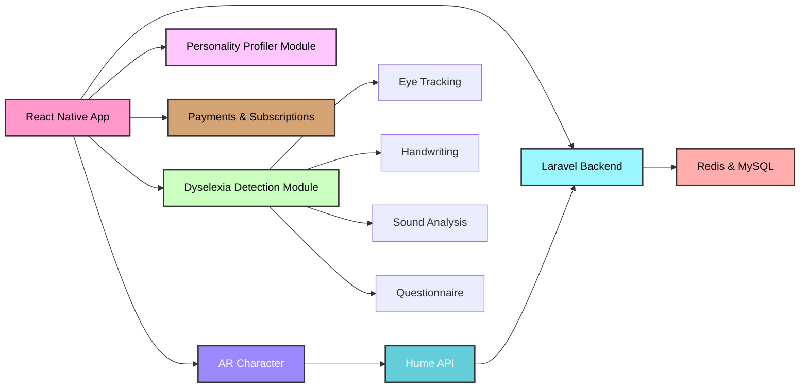

# 🌟 **AR Learning Aid (Edulex AI)** 🌟  
**An AI-powered learning platform tailored for dyslexic students.**

[](https://github.com/edulex) [](https://github.com/edulex) [](https://github.com/edulex)  

---

## 📖 **Table of Contents**
1. [Overview](#overview)  
2. [System Architecture](#system-architecture)  
3. [Repository Structure](#repository-structure)  
4. [Sub-Repository Details](#sub-repository-details)  
5. [Tech Stack](#tech-stack)  
6. [Roadmap](#roadmap)  
7. [Deployment & Installation](#deployment--installation)  
8. [Scalability](#scalability)  
9. [Methodology](#methodology)  
10. [Maintainers](#maintainers)  

---

## 📜 **Overview**
Edulex AI is a private project focused on improving learning outcomes for dyslexic students by leveraging AI and AR technologies. The platform provides tools like a mobile app with interactive AR experiences, a backend for user and data management, and a detection API to identify dyslexia patterns. The repository is organized as a monorepo for seamless integration of all components.

---

## 🎨 **System Architecture**
Here’s how the app connects to the overall Edulex ecosystem:



The **Mobile App** is central to the system, connecting seamlessly with:  
- **Backend Services**: Handles users, AI processing, and APIs.  
- **Dyslexia Detection API**: Analyzes and provides learning recommendations.  
- **Landing Website**: Showcases Edulex AI’s features.  
- **Documentation**: Developer and maintainer guides.

---

## 📂 **Repository Structure**
The repository is organized as a **monorepo**, bundling all critical components:  

```plaintext
Edulex-AI/
├── app/                     # Mobile app (React Native)
├── backend/                 # Core backend services
├── dyslexia-detection-api/  # API for dyslexia detection
├── landing/                 # Public-facing website (prod branch)
├── docs/                    # Internal documentation
└── README.md                # This file
```

Each folder represents a sub-repository for modular and scalable development.

---

## 📜 **Sub-Repository Details**

### 1️⃣ **Dyslexia Detection API**
- **Path**: `./dyslexia-detection-api/`  
- **Purpose**: Detect patterns in text to assist dyslexic students.  
- **Features**:  
  - Machine learning-based text analysis.  
  - Integration with backend for personalized recommendations.

---

### 2️⃣ **Backend**
- **Path**: `./backend/`  
- **Purpose**: Core logic for managing users, AI processing, and APIs.  
- **Features**:  
  - User authentication and management.  
  - Communication with the detection API and app.  
  - Centralized API endpoints.

---

### 3️⃣ **Landing Website**
- **Path**: `./landing/`  
- **Purpose**: Edulex AI’s public-facing website.  
- **Branch**: `prod` (live site).  
- **Features**:  
  - Explains platform features.  
  - Manages user signups and outreach.

---

### 4️⃣ **Mobile App**
- **Path**: `./app/`  
- **Purpose**: Primary interface for students.  
- **Features**:  
  - AR-based games and quizzes.  
  - Emotion recognition using Hume AI.  
  - Tools for reading and learning assistance.

---

### 5️⃣ **Documentation**
- **Path**: `./docs/`  
- **Purpose**: Internal guides for developers and maintainers.  
- **Includes**:  
  - Setup instructions.  
  - System architecture diagrams.  
  - Debugging and maintenance tips.

---

## 🛠 **Tech Stack**
- **Frontend**: React Native, Tailwind CSS  
- **Backend**: Node.js, Laravel, FastAPI  
- **AI**: Hume AI, Machine Learning models  
- **Database**: MySQL, Supabase  
- **Hosting**: Wexron Hosting, DigitalOcean, Cloudflare DNS  

---

## 🚧 **Roadmap**
- [x] Integrate Dyslexia Detection API with backend.  
- [x] Develop AR quizzes and games.  
- [x] Deploy the `prod` branch for the landing site.  
- [ ] Enhance emotion recognition using real-time analysis.  
- [ ] Expand database for multilingual learning support.  

---

## 🚀 **Deployment & Installation**
1. Clone the repository:  
   ```bash
   git clone git@github.com:edulex/edulex-ai.git
   cd edulex-ai
   ```
2. Install dependencies:  
   ```bash
   npm install
   ```
3. Run the project:  
   ```bash
   npm start
   ```

---

## 🌐 **Scalability**
Edulex AI’s modular structure ensures:
- Easy updates for individual components without affecting others.  
- Seamless scaling to support more students and features.  
- Multi-cloud deployment for enhanced reliability.

---

## 📚 **Methodology**
Edulex AI is built on agile principles, focusing on:
- Incremental development for rapid feature delivery.  
- AI-driven insights for personalized learning.  
- Feedback loops for continuous improvement.  

---

## 👨‍💻 **Maintainers**
- **Albin Varghese ✨** ([albinvar](https://github.com/albinvar))  
- **Athul Krishna** ([akomblished_bug](https://github.com/akomblished_bug))  
- **Rahul Abraham** ([rahul](https://github.com/rahul))  
- **Sidharth Gopalakrishnan** ([sidhu](https://github.com/sidhu))  

---
